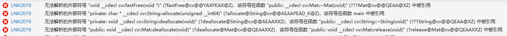

# about cpp
## c++ vector
https://blog.csdn.net/duan19920101/article/details/50617190/
## 图像处理
### 图像灰度化
用python、matlab、c++实现:https://blog.csdn.net/what_lei/article/details/48681903
### 图像的缩放
利用resize函数 
https://blog.csdn.net/u012005313/article/details/51943442

## 数值类型转换
### string和char*之间的转换
https://www.cnblogs.com/Pillar/p/4206452.html
### OpenCV中将MAT类型的对象作为InputArray类型的对像传递给函数
https://blog.csdn.net/NNNNNNNNNNNNY/article/details/50203223
## about visual studio
### 无法解析的外部符号
#### 错误显示

#### 解决方法
可以看到是因为opencv的库出现了问题，可以参考一下步骤解决： 1.下载opencv3.4.0。 2.在“项目名”——属性——VC++目录——包含目录和库目录中分别加入opencv安装包中的include目录和lib目录 3.在“项目名”——属性——链接器——输入——附加依赖项添加lib文件名称（opencv_world340.lib;opencv_world340d.lib;） 注意：2和3中release和debug要分别配置。 4.另外记得把opencv的dll加入环境变量。
## 关于内存释放
string是不需要释放的
## clock项目进行
### resize时需要考虑的问题
1.resize到160*160 
2.图像占比问题 
3.resize后图像变形问题（按照短边剪裁为方形然后resize） 
### gray时需要考虑的问题
1.如果本来就是gray图像的处理
### 二值化处理
1.原来的二值化函数不能用，要对图像进行二值化